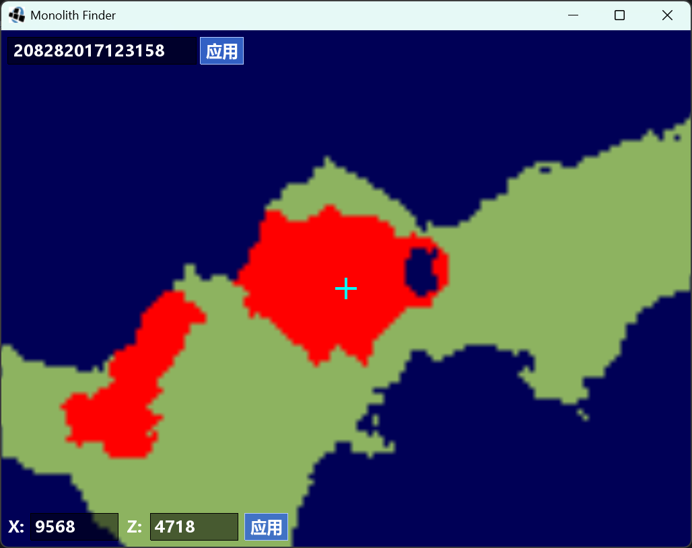

# Monolith Finder (Java)

一个用于可视化 Minecraft 版本 `inf-20100611` 至 `a1.1.2_01` 地形（含 monolith）的工具，是原 Rust/WASM 版 [monolith-renderer](https://github.com/kahomayo/monolith-renderer) 的 Java + LWJGL3 移植版。



## 功能

- 复刻旧版 Minecraft 的 3D Perlin 噪声与 `ChunkGenerator` 世界生成算法（bit-exact，已验证与 Rust 测试向量一致）。
- 以瓦片形式渲染地形，自动区分陆地 / 水域 / monolith / 边境之地。
- 异步瓦片加载，缩放 / 平移流畅不卡顿。
- 画面中心 MC 样式反色十字准星。
- 左上角种子输入框、左下角坐标输入框，可随时跳转与修改。
- 可缩放窗口（拖动边缘 / 最大化自适应）。

## 运行

依赖：JDK 8+（建议 17+）。`lib/` 下已包含 LWJGL3 运行库（含各平台 native，随 classpath 自动加载）。

```bat
compile.bat          :: 编译源码并打包为 monolith-finder.jar
run.bat [seed]       :: 运行打包好的 jar
```

例：先执行 `compile.bat`，再执行 `run.bat 8676641231682978167`。

### 操作

- 鼠标拖拽 / 方向键 / WASD：平移
- 滚轮 / `+` / `-`：缩放（向上滚轮放大）
- 左上角输入框：修改种子（含应用按钮）
- 左下角输入框：修改 X / Z 坐标（含应用按钮）
- `R`：随机种子
- `Esc`：退出

## 验证

运行 `verify.bat` 可校验核心算法，应输出全部测试向量通过。

## 目录结构

```
src/                 Java 源码
docs/                开发文档
lib/                 LWJGL3 运行库（含各平台 native）
build/               编译中间输出
monolith-finder.jar  打包产物（由 compile.bat 生成）
```

## 开发

详见 [docs/development.md](docs/development.md)。

## 许可与来源

本项目为 [kahomayo/monolith-renderer](https://github.com/kahomayo/monolith-renderer) 的 fork，原仓库未声明许可证（默认保留所有权利）。

本仓库中的 Java 移植实现（`src/`）由本 fork 维护者编写，欢迎用于学习与二次开发。原 Rust 算法部分版权归原作者所有，若原作者要求移除相关内容，本仓库会配合处理。